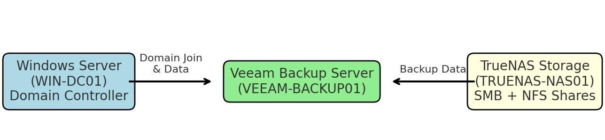
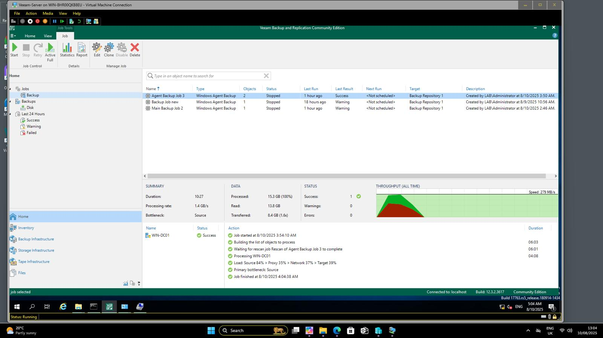

# ISO/IEC 27001:2022 Audit Applied to Backup & Disaster Recovery Project  

## 📌 Project Overview  

This repository demonstrates how I applied **ISO/IEC 27001:2022 Lead Auditor practices** to a real-world **Backup & Disaster Recovery (BDR)** scenario.  

A business case required secure data protection and resilience against system failures. To address this need, I:  

- Designed, implemented, and tested a **lab-based BDR environment**.  
- Built and applied an **ISO 27001 Audit Checklist** aligned with the 2022 standard.  
- Documented compliance, governance, and risk management using a **Lead Auditor approach**.  

This project highlights both **technical expertise** (system setup, backup, and recovery) and **auditing skills** (ISO alignment, compliance documentation, and governance).  

## 📂 Repository Contents  
- **ISO27001_Audit_Checklist_with_Cover.xlsx**  
  → A full audit checklist (with clauses, Annex A controls, risk treatment, SoA references, and auditor notes).  
- **Project Narrative**  
  → Background and explanation of the lab-based backup & DR setup.  
- **images/**  
  → Contains Veeam, TrueNAS, and checklist preview screenshots.

---

## 🖥️ Lab Setup  

- **Windows Server (WIN-DC01)** → Active Directory & DNS for centralized domain management.  
- **Veeam Backup Server (VEEAM-BACKUP01)** → Backup scheduling & management.  
- **TrueNAS Storage (TRUENAS-NAS01)** → Secure SMB-based backup repository.  

---

## ✅ Achievements  

- Configured AD/DNS for seamless domain communication.  
- Created secure SMB shares for Veeam repositories.  
- Successfully backed up both the **Domain Controller** and **Veeam Backup Server**.  
- Verified recovery capability with restore testing.  

---

## 📋 ISO/IEC 27001:2022 Audit Integration  

The BDR solution was mapped against **ISO/IEC 27001:2022 Clauses and Annex A controls**:  

- **Clause 6.1 (Risk Treatment):** Risks such as data loss & ransomware were assessed and treated.  
- **Annex A.8.12 (Data Backup):** Automated, scheduled Veeam backups stored on TrueNAS.  
- **Annex A.5.29 (Information Security During Disruption):** Continuity ensured during system outages.  
- **Annex A.5.30 (ICT Readiness for Business Continuity):** Recovery readiness validated through restore tests.  
- **Annex A.8.16 (Monitoring Activities):** Monitoring of backup operations and alerts.  
- **SoA (Statement of Applicability):** Documented applied vs. excluded Annex A controls.  
- **Audit Checklist:** Simulated a real **Lead Auditor’s review** process.  

---

---

## 📸 Screenshots  

### 🔹 Backup_Process – Successful Run  
  

### 🔹 Veeam Backup Job – Successful Run  
  

### 🔹 TrueNAS – Backup Repository  
  

### 🔹 ISO27001 Audit Checklist (Excel Preview)  
.xlsx)  

*(Screenshots are anonymized demo data for confidentiality)*  

---

## 📋 ISO/IEC 27001:2022 Audit Integration  
I mapped the **backup and disaster recovery solution** against ISO 27001 clauses and Annex A controls.  

## 🔍 Line-by-Line Audit Mapping  

- **Clause-only requirements (not linked to Annex A):** 4.3, 6.1.2, 7.2, 8.2, 9.2, 9.3, 10.2.  
- **Mapped to Annex A controls:**  
  - **A.8.12 (Data Backup)**  
  - **A.5.29 (Information Security During Disruption)**  
  - **A.5.30 (ICT Readiness for Business Continuity)**  
  - **A.8.16 (Monitoring Activities)**  
  - **A.8.14 (Redundancy)**  
  - **A.8.21 (Security of Network Services)**  
  - **A.8.23 (Web Filtering)** 
- **Audit Checklist** → Built to simulate a real Lead Auditor’s review process.   

---

  **Key Difference:**  
- **Clauses** = Mandatory ISMS requirements (e.g., internal audit, management review).  
- **Annex A** = Catalogue of security controls (technical & organizational).

---

## 🚀 Why This Project Matters  
This project demonstrates how **information security auditing (ISO 27001)** and **technical backup solutions** come together to protect businesses.  
It reflects not just IT skills, but also **compliance, governance, SOA, and risk management expertise** — crucial for real-world cybersecurity roles.  

---

## 📫 Connect with Me  
If you’re interested in data protection, ISO 27001 auditing, or tailored disaster recovery solutions, let’s connect!  
[LinkedIn Profile](#) | [Portfolio](#)
