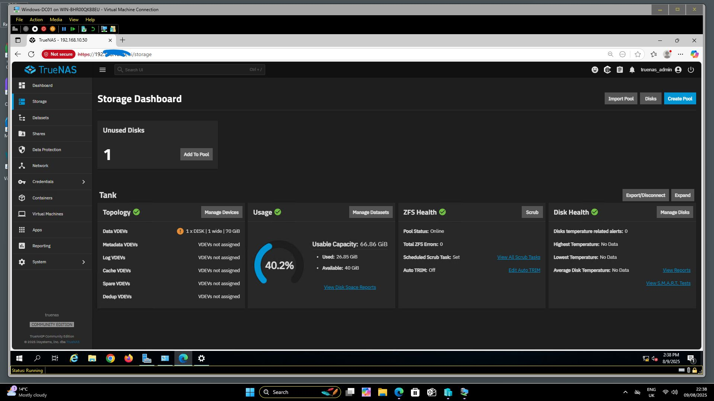

# ISO/IEC 27001:2022 Audit Applied to Backup & Disaster Recovery Project   

## 📌 Project Overview  
This repository showcases how I applied **ISO/IEC 27001:2022 Lead Auditor practices** to a real-world **Backup & Disaster Recovery (BDR) project**.  

A friend’s growing business needed to secure its data and ensure resilience against system failures. I designed, tested, and implemented a **lab-based BDR environment**, then created an **ISO 27001 Audit Checklist** to demonstrate compliance with international information security standards.  

This project highlights both my **technical expertise** and **auditing skills**.  

---

## 🖥️ Lab Setup  
- **Windows Server (WIN-DC01)** → Active Directory & DNS for centralized domain management.  
- **Veeam Backup Server (VEEAM-BACKUP01)** → Managing and scheduling backups.  
- **TrueNAS Storage (TRUENAS-NAS01)** → Secure SMB storage for backup files.  

✅ Achievements:  
- Configured AD/DNS for seamless communication.  
- Created secure SMB shares for Veeam repositories.  
- Successfully backed up Domain Controller & Veeam server.  

---

## 📸 Screenshots  

### 🔹 Backup_Process – Successful Run  
  

### 🔹 Veeam Backup Job – Successful Run  
  

### 🔹 TrueNAS – Backup Repository  
  

### 🔹 ISO27001 Audit Checklist (Excel Preview)  
  

*(Screenshots are anonymized demo data for confidentiality)*  

---

## 📋 ISO/IEC 27001:2022 Audit Integration  
I mapped the **backup and disaster recovery solution** against ISO 27001 clauses and Annex A controls.  

### Key Highlights:  
- **Clause 6.1 (Risk Treatment)** → Identified risks like data loss & ransomware, applied backup solutions.  
- **Annex A.8.13 (Information Backup)** → Verified regular backups to TrueNAS with Veeam.  
- **Annex A.5.29 (Information Security During Disruption)** → Ensured resilience of services during incidents.  
- **Annex A.5.30 (ICT Readiness for Business Continuity)** → Confirmed readiness to restore business operations.  
- **SoA (Statement of Applicability)** → Documented which Annex A controls were applied or excluded.  
- **Audit Checklist** → Built to simulate a real Lead Auditor’s review process.   

---

## 📂 Repository Contents  
- **ISO27001_Audit_Checklist_with_Cover.xlsx**  
  → A full audit checklist (with clauses, Annex A controls, risk treatment, SoA references, and auditor notes).  
- **Project Narrative**  
  → Background and explanation of the lab-based backup & DR setup.  
- **images/**  
  → Contains Veeam, TrueNAS, and checklist preview screenshots.  

---

## 🚀 Why This Project Matters  
This project demonstrates how **information security auditing (ISO 27001)** and **technical backup solutions** come together to protect businesses.  
It reflects not just IT skills, but also **compliance, governance, and risk management expertise** — crucial for real-world cybersecurity roles.  

---

## 📫 Connect with Me  
If you’re interested in data protection, ISO 27001 auditing, or tailored disaster recovery solutions, let’s connect!  
[LinkedIn Profile](#) | [Portfolio](#)
